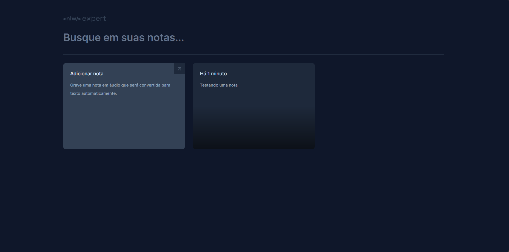
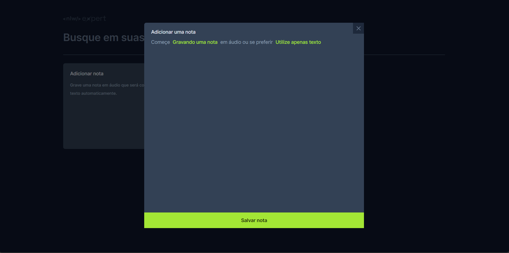
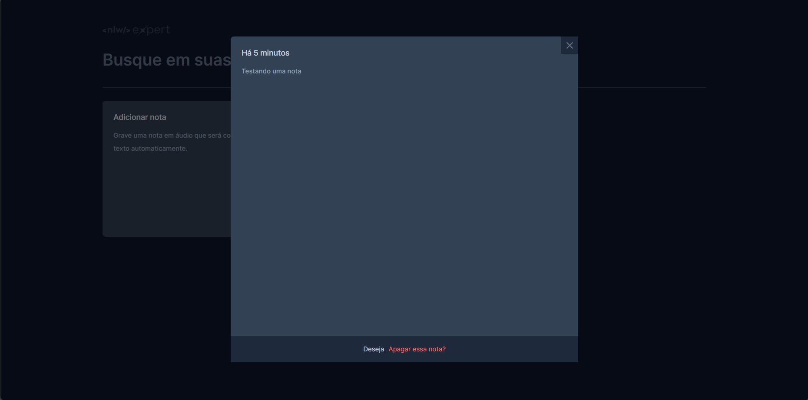

# NLW React JS - Notes

This is a React JS project, designed for intuitive and efficient note-taking. A distinctive feature of the application is its ability to convert audio to text, providing users with a convenient way to input information.

## Screenshots

 

 

 

Production link: https://nlw-reactjs-notes.vercel.app/
